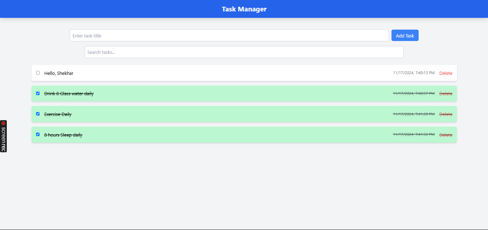

## Task Manager App

## *Description*
The Task Manager App is a React-based application for creating, managing, and organizing tasks. It features:

`Task creation with timestamps`
`Task deletion`
`Local storage for data persistence`
`Search functionality`
`Mark tasks as completed`
`Tailwind CSS for styling`
`UI animations for a modern look and feel`

# Features
*Task Input*: Add tasks with a title.
*Task Deletion*: Remove tasks from the list.
*Local Storage*: Tasks persist across sessions.
*Task Completion*: Mark tasks as completed.
*Search*: Search for tasks by title.
*Responsive Design*: Works across devices.
*Animations*: Smooth transitions and effects.

# Setup and Launch Instructions:

Firstly, In the project directory, you can run:

# `npm install`

And now, you can run:

# `npm start`

# Assumptions Made:

*Tasks have a unique title or ID to avoid duplicates.*
*Tasks are stored in local storage for simplicity.*
*The app is designed for desktop and mobile browsers.*

# Screenshots:

*Task Manager - Home*

*Add Task*

*Searching Task*

*Task Completion*

